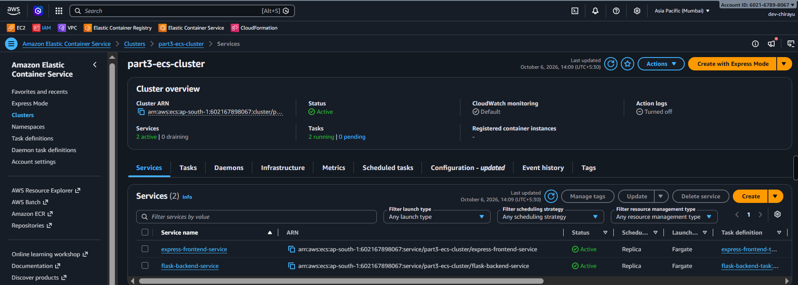
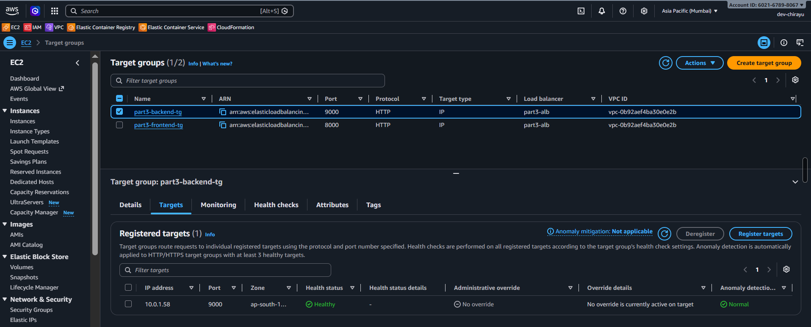
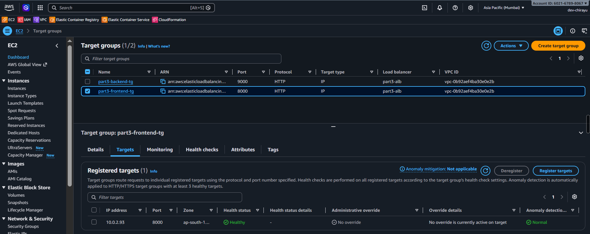
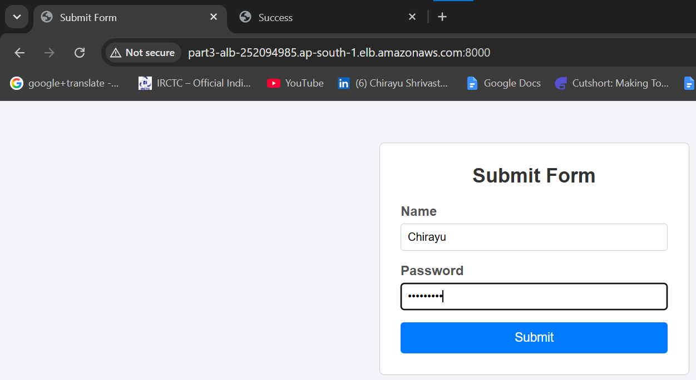
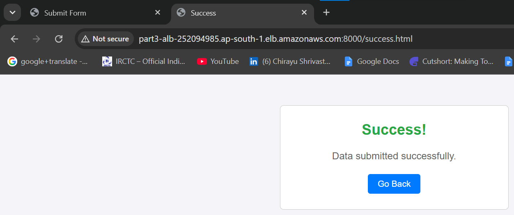
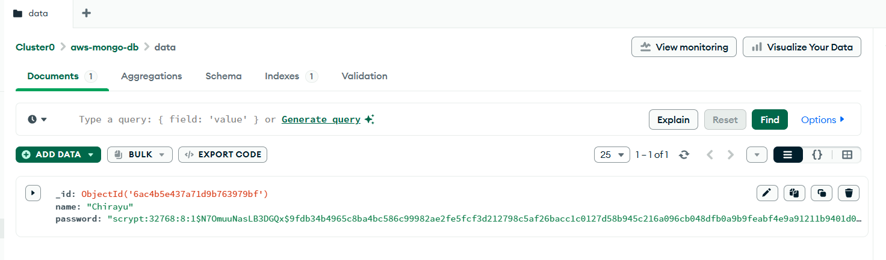

# AWS Deployment Assessment: Flask & Express Infrastructure

This repository contains the complete Infrastructure as Code (IaC) using Terraform to deploy a Flask backend and Express frontend across three different AWS architecture configurations.

---

## Project Architecture Overview

### **Part 1: Single EC2 Instance Deployment**

- **Objective:** Deploy both Flask backend (port 9000) and Express frontend (port 8000) on a single AWS EC2 instance.
- **Key Features:**
  - Automated provisioning via Terraform (`terraform/part1-single-ec2`).
  - Shell user-data script to install Node.js, Python3, Git, and set up background services (`nohup`).
  - Single Security Group opening SSH (22), Frontend (8000), and Backend (9000).

---

### **Part 2: Separate EC2 Instances Deployment**

- **Objective:** Deploy Flask backend and Express frontend on two isolated EC2 instances in a custom VPC.
- **Key Features:**
  - Custom VPC (`10.0.0.0/16`), Public Subnet, Internet Gateway, and Route Tables.
  - Dedicated Security Groups for Backend (`part2-backend-sg`) and Frontend (`part2-frontend-sg`).
  - Dynamic inter-instance communication: Express frontend connects directly to Flask backend's Private IP on port 9000.

---

### **Part 3: Containerized Deployment via Docker, AWS ECR, ECS Fargate & ALB**

- **Objective:** Deploy Flask and Express as Docker containers using AWS ECR, ECS Fargate, and an Application Load Balancer.
- **Key Features:**
  - **Docker & ECR:** Containerized applications pushed to AWS Elastic Container Registry (`flask-backend` and `express-frontend`).
  - **AWS ECS Fargate:** Serverless container orchestration running ECS Tasks in an ECS Cluster (`part3-ecs-cluster`).
  - **Application Load Balancer (ALB):** Public ALB (`part3-alb`) routing traffic to Target Groups (`port 8000` for Frontend, `port 9000` for Backend) with automated `/health` checks.
  - **Database:** MongoDB Atlas integration for persistent data storage verified end-to-end.

---

## Deployment Instructions

### **Prerequisites**

- AWS CLI configured with appropriate IAM credentials (`aws configure`).
- Terraform CLI installed.
- Docker Desktop installed and running.

---

### **Part 1, 2, 3 Deployment Commands**

```bash
cd terraform/part1-single-ec2
terraform init
terraform plan
terraform apply -auto-approve
```

---

## Part 3 (ECS + ALB) - Main Proofs

1. **AWS ECS Cluster Console:** `part3-ecs-cluster` showing 2 Active Services and 2 Running Tasks.

   

2. **Target Groups Console (Targets tab):** View showing the `Healthy` status of `part3-backend-tg` and `part3-frontend-tg`.

   
   

3. **Browser Output:**
   - Frontend form on the ALB URL (http://part3-alb-252094985.ap-south-1.elb.amazonaws.com:8000/).

     

   - Success page (`/success.html`) after submitting the form.

     

4. **MongoDB Atlas Database Console:** The saved document in the database collection (proof that data storage is working).

   
